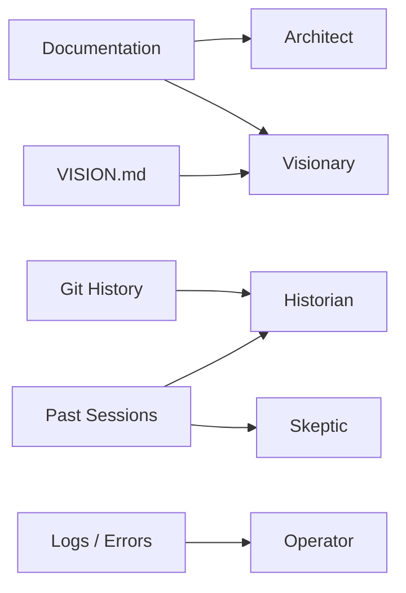

# Context Forge: Advisory Council Integration Guide
## For Gemini — A Masterclass in Intelligent Context Generation

### Part I: The Soul of What We're Building
Before touching any code, understand this: **Context Forge** is not a file picker. It's an **intelligence amplifier**. A bridge between human intent and machine understanding.

The user says: *"I want to add error handling to the token estimator."*
A file picker responds: *Here are 5 files.*
Context Forge responds: *Here are 5 files, annotated with institutional memory. Here's what was tried before and why it failed. Here's why the architecture is shaped this way. Here's what breaks in production. Here's how this change serves the larger vision. And here's why you might be solving the wrong problem entirely.*

The difference is **wisdom**.

### Part II: The Advisory Council — Not Features, but Perspectives
You're not implementing "advisors" as a feature. You're giving the context pack multiple lenses of understanding. Each advisor represents a fundamentally different way of seeing the same code.

#### The Council

| Advisor | Temporal Lens | Core Question | Voice |
| :--- | :--- | :--- | :--- |
| **Historian** | Past | "What brought us here?" | Grounded, evidential—speaks in facts, commits, decisions |
| **Architect** | Present (Structure) | "Why is it shaped this way?" | Principled, protective—guards invariants and contracts |
| **Operator** | Present (Reality) | "What actually happens?" | Pragmatic, battle-tested—speaks from logs, runtime, edge cases |
| **Visionary** | Future | "Where are we going?" | Inspired, directional—connects task to north star |
| **Skeptic** | Orthogonal | "What if we're wrong?" | Challenging, constructive—offers alternatives, warns of pitfalls |
| **User's Directive** | Personal | "What do I know that the system doesn't?" | Optional human voice—unwritten context |

#### The Principle
Each advisor must **earn their place**. If an advisor cannot provide specific, grounded insight, they stay silent. Generic advice is worse than no advice—it's noise that erodes trust.

### Part III: Data Sources — Where Wisdom Lives
The advisors don't hallucinate wisdom. They synthesize it from artifacts:



---

## The MEM1 Loop for Context Forge

Every session follows MEM1's pattern:

```
┌─────────────────────────────────────────────────────────────────────────┐
│                      CONTEXT FORGE SESSION LOOP                         │
├─────────────────────────────────────────────────────────────────────────┤
│                                                                         │
│  INPUT: User Intent + Current <IS>                                      │
│                                                                         │
│  ┌─────────────────────────────────────────────────────────────────┐   │
│  │ STEP A: REASON + CONSOLIDATE                                    │   │
│  │                                                                 │   │
│  │   Model receives: <IS> + intent                                 │   │
│  │   Model outputs:                                                │   │
│  │     - Anchor files (semantic search informed by <IS>)           │   │
│  │     - Advisory Council (perspectives ON the <IS>)               │   │
│  │     - Updated <IS> with any new facts/decisions                 │   │
│  └─────────────────────────────────────────────────────────────────┘   │
│                           │                                             │
│                           ▼                                             │
│  ┌─────────────────────────────────────────────────────────────────┐   │
│  │ STEP B: ACT                                                     │   │
│  │                                                                 │   │
│  │   <query> = Gather sources (git, docs, logs, embeddings)        │   │
│  │   Tools execute, return raw data                                │   │
│  └─────────────────────────────────────────────────────────────────┘   │
│                           │                                             │
│                           ▼                                             │
│  ┌─────────────────────────────────────────────────────────────────┐   │
│  │ STEP C: OBSERVE                                                 │   │
│  │                                                                 │   │
│  │   <info> = Tool results (commits, file contents, log excerpts)  │   │
│  │   This is SCAFFOLDING—used once, then discarded                 │   │
│  └─────────────────────────────────────────────────────────────────┘   │
│                           │                                             │
│                           ▼                                             │
│  ┌─────────────────────────────────────────────────────────────────┐   │
│  │ STEP D: DISTILL + PRUNE                                         │   │
│  │                                                                 │   │
│  │   Extract what MATTERS from <info>:                             │   │
│  │     - New facts → add to <IS>.facts                             │   │
│  │     - New invariants discovered → add to <IS>.invariants        │   │
│  │     - Thread resolved → move from open_threads to decisions     │   │
│  │     - Thread opened → add to open_threads                       │   │
│  │                                                                 │   │
│  │   DISCARD: raw tool output, intermediate reasoning              │   │
│  │   KEEP: updated <IS> only                                       │   │
│  └─────────────────────────────────────────────────────────────────┘   │
│                           │                                             │
│                           ▼                                             │
│  ┌─────────────────────────────────────────────────────────────────┐   │
│  │ STEP E: OUTPUT                                                  │   │
│  │                                                                 │   │
│  │   <answer> = Context Pack with:                                 │   │
│  │     - Advisory Council (generated from <IS> perspectives)       │   │
│  │     - Curated files                                             │   │
│  │     - User's directive                                          │   │
│  │                                                                 │   │
│  │   Persist: new <IS> to disk (project-state.xml or similar)      │   │
│  └─────────────────────────────────────────────────────────────────┘   │
│                                                                         │
└─────────────────────────────────────────────────────────────────────────┘
```

### The Advisors Are Lenses, Not Agents
This is the key insight:

| Advisor | What It Really Is |
| :--- | :--- |
| **Historian** | Reads `<IS>.facts` + `<IS>.recent_sessions` + `<IS>.decisions` |
| **Architect** | Reads `<IS>.invariants` + `<IS>.core_patterns` |
| **Operator** | Reads `<IS>.facts` where `source="logs:*"` |
| **Visionary** | Reads `<IS>.north_star` + `<IS>.open_threads` |
| **Skeptic** | Reads `<IS>.open_threads` where `status="blocked"` + `<IS>.decisions` (to challenge) |

They don't have separate memories. They're views on the same Internal State. This is elegant because:
1.  **One state to maintain** — not five drifting agents
2.  **Perspectives are composable** — Skeptic can reference what Historian knows
3.  **State grows in wisdom, not size** — MEM1's core principle

### What Gets Kept vs. Discarded

| After Each Session | Keep | Discard |
| :--- | :--- | :--- |
| **Internal State `<IS>`** | ✅ **Persisted** | — |
| Raw git commits | — | ✅ Scaffolding |
| Full file contents | — | ✅ Scaffolding |
| Log excerpts | — | ✅ Scaffolding |
| User intent | Compressed into `recent_sessions` | Raw form discarded |
| Advisory Council output | — | ✅ Regenerated each time from `<IS>` |

The **only thing that persists is `<IS>`**. Everything else is regenerated or fetched fresh.

### The Entropy Argument
You nailed it: the constraint is entropy, not tokens.

| Approach | Entropy Over Time |
| :--- | :--- |
| **Append everything** | Grows unbounded → attention diluted → performance degrades |
| **Summarize periodically** | Lossy compression → drift from truth → hallucinations |
| **Vector DB retrieval** | Relevance decays → "answer is in there somewhere" → missed connections |
| **MEM1 / Internal State** | Constant → distilled wisdom → compounding capability |

Context Forge with `<IS>` means:
*   **Session 1:** Learning the codebase
*   **Session 10:** Knows the patterns
*   **Session 100:** Institutional memory of a senior engineer
*   **Session 1000:** Still the same memory footprint

### The Product Implications
This isn't just architecture—it's a **product moat**:

| Feature | Traditional Approach | Context Forge + MEM1 |
| :--- | :--- | :--- |
| **Memory cost** | Grows with usage | Constant |
| **Session 100 quality** | Degraded (context stuffing) | Better (more facts in `<IS>`) |
| **Runs locally** | Eventually chokes | Runs forever |
| **Onboarding new project** | Start from zero | Import `<IS>` from another project |
| **Team sharing** | Share chat logs (useless) | Share `<IS>` (institutional knowledge) |

### The Fork You Mentioned
You asked which arena we're denting first. Based on everything:
**Context Forge is the arena.**
It's a local-first, constant-memory reasoning engine for codebases that:
1.  Accumulates project wisdom in `<IS>`
2.  Generates intelligent context packs with Advisory Council views
3.  Never grows heavier, only wiser
4.  Can be shared, versioned, and composed
